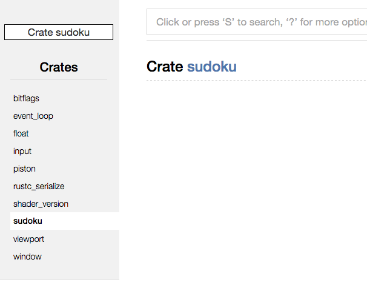

# Welcome to the Sudoku tutorial!
by Sven Nilsen, 2017

In this tutorial, you will learn how to create a Sudoku game with Piston.
This tutorial is a bit long, because it goes step by step through the thinking process when developing a game.
Expect to spend a day or two getting through this!

I assume you have gotten through the [getting-started](../getting-started) tutorial and know how to set up a new Rust project.
Some of these steps will be repeated briefly in the first chapter.

## Chapter 1

Type the following command in the Terminal window:

```
cargo new --bin sudoku
cd sudoku
```

In the file "src/main.rs", type the following:

```rust
fn main() {
    println!("hi");
}
```

To test that it runs, type this in the Terminal window:

```
cargo run
```

What you should see:

```
$ cargo run
   Compiling sudoku v0.1.0 (file:///Users/sven/rust/Piston-Tutorials/sudoku)
    Finished dev [unoptimized + debuginfo] target(s) in 2.42 secs
     Running `target/debug/sudoku`
hi
```

If this is not working, you might have forgotten the `--bin` flag after `cargo new`. Delete the folder and try again.

Now, we need to add a few libraries to the Cargo.toml.
To make this more efficient, we will install the tool `cargo-edit` such that we can type `cargo add <package>`.
To install `cargo-edit`, type the following:

```
cargo install cargo-edit
```

The first library we will add is `piston`.
This is the core library of the Piston game engine.

Type the following in the Terminal window:

```
cargo add piston
```

When you open up "Cargo.toml", you should see:

```
[dependencies]
piston = "*"
```

The star tells Cargo to get the latest compatible version.
This means that you do not have to figure out which library version
works with other library versions, it will figure it out for you.

Change the "main.rs" file:

```rust
extern crate piston;

use piston::window::WindowSettings;

fn main() {
    let settings = WindowSettings::new("Sudoku", [512; 2])
        .exit_on_esc(true);

    println!("{}", settings.get_exit_on_esc());
}
```

When typing `cargo run` in the Terminal window, you should see
the program printing out "true".

The first line, `extern crate piston;`, tells the Rust compiler to look
for a crate called "piston".
The second line `use piston::window::WindowSettings;` imports the
`WindowSettings` struct from the submodule `window` in the `piston` crate.

We created an object called `settings` by calling the function
`WindowSettings::new`.
This function takes two parameters, the title of the window, and the
window size.
Then we call `.exit_on_esc(true);` to set the flag that
we want it the window to exit when we press ESC on the keyboard.

The `WindowSettings` struct is used to tell the window backend
how to load the window.
It reads out the settings by calling the methods.
For example, `settings.get_exit_on_esc()` like we just did.

Not every window backend in Piston is guaranteed to respect the settings
you choose.
For example, if the window runs on a platform where all applications
run fullscreen, it will ignore whether you set `.fullscreen(true)` or
`.fullscreen(false)`.

To view the docs, type the following in the Terminal window:

```
cargo doc --open
```

This will open up the project's documentation in the default browser.



On the left side are all the crates in the dependency graph of your project.
At the top you can search for "WindowSettings" to find it in the docs.

Here is a list of useful window settings:

- fullscreen
- exit_on_esc
- samples
- vsync
- opengl
- srgb
- resizable
- decorated
- controllers

[Goto Chapter 2](chp-02.md)
