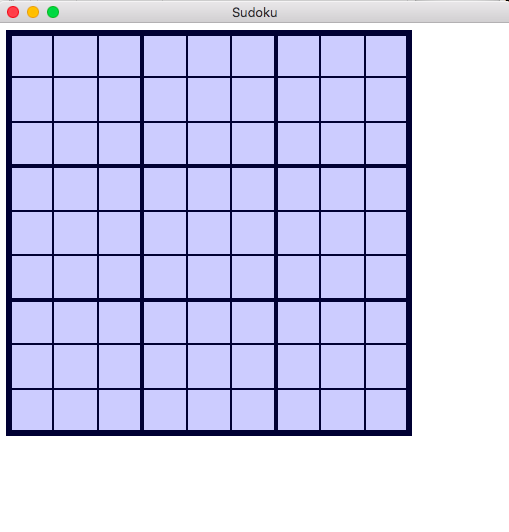
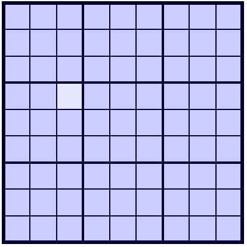

# Sudoku tutorial
by Sven Nilsen, 2017

# Chapter 5

Add the following code to `GameboardView::draw`:

```rust
  /// Draw gameboard.
  pub fn draw<G: Graphics>(&self, controller: &GameboardController, c: &Context, g: &mut G) {
      use graphics::{Line, Rectangle};

      let ref settings = self.settings;
      let board_rect = [
          settings.position[0], settings.position[1],
          settings.size, settings.size,
      ];

      // Draw board background.
      Rectangle::new(settings.background_color)
          .draw(board_rect, &c.draw_state, c.transform, g);

      // Draw cell borders.
      let cell_edge = Line::new(settings.cell_edge_color, settings.cell_edge_radius);
      for i in 0..9 {
          // Skip lines that are covered by sections.
          if (i % 3) == 0 {continue;}

          let x = settings.position[0] + i as f64 / 9.0 * settings.size;
          let y = settings.position[1] + i as f64 / 9.0 * settings.size;
          let x2 = settings.position[0] + settings.size;
          let y2 = settings.position[1] + settings.size;

          let vline = [x, settings.position[1], x, y2];
          cell_edge.draw(vline, &c.draw_state, c.transform, g);

          let hline = [settings.position[0], y, x2, y];
          cell_edge.draw(hline, &c.draw_state, c.transform, g);
      }

      // Draw section borders.
      let section_edge = Line::new(settings.section_edge_color, settings.section_edge_radius);
      for i in 0..3 {
          // Set up coordinates.
          let x = settings.position[0] + i as f64 / 3.0 * settings.size;
          let y = settings.position[1] + i as f64 / 3.0 * settings.size;
          let x2 = settings.position[0] + settings.size;
          let y2 = settings.position[1] + settings.size;

          let vline = [x, settings.position[1], x, y2];
          section_edge.draw(vline, &c.draw_state, c.transform, g);

          let hline = [settings.position[0], y, x2, y];
          section_edge.draw(hline, &c.draw_state, c.transform, g);
      }

      // Draw board edge.
      Rectangle::new_border(settings.board_edge_color, settings.board_edge_radius)
          .draw(board_rect, &c.draw_state, c.transform, g);
  }
```

Piston-Graphics splits data into high and low frequency usage.
`Line` and `Rectangle` store color and edge information,
but the coordinates are passed to the `.draw` method call.
This makes it easy to reuse these objects by declaring them before loops.

`Line` stores the coordinates in the format `[x1, y1, x2, y2]`.
`Rectangle` stores the coordinates in the format `[x, y, w, h]`.

In addition to the shape, the `.draw` method requires the draw state
from `Context`, a matrix transform (often `c.transform`) and the graphics backend.

If you are familiar with other APIs like Cairo or GDI+, you might think
the way Piston-Graphics does drawing is somewhat unfamiliar.
In these APIs the context and the object that renders is the same thing.
In Piston-Graphics, `Context` is separated from the object implementing
`Graphics`.

By manipulating the `Context` object, one can use the default stack as
a way to push/pop transforms.

The draw state stores things like scissor rectangle, stencil usage and
blending settings.

The matrix transform is use to translate, rotate, scale etc. the shape.

When you type `cargo run` in the Terminal window, you should see:



Next, we want to be able to select a cell.

Add a new field `selected_cell` to `GameboardController`:

```rust
/// Handles events for Sudoku game.
pub struct GameboardController {
    /// Stores the gameboard state.
    pub gameboard: Gameboard,
    /// Selected cell.
    pub selected_cell: Option<[usize; 2]>,
}
```

In `GameboardController::new`, set `selected_cell` to `None`:

```rust
  /// Creates a new gameboard controller.
  pub fn new(gameboard: Gameboard) -> GameboardController {
      GameboardController {
          gameboard: gameboard,
          selected_cell: None,
      }
  }
```

Add a new field `cursor_pos` to `GameboardController`:

```rust
  /// Stores last mouse cursor position.
  cursor_pos: [f64; 2],
```

In `GameboardController::new`, set `cursor_pos` to `[0.0; 2]`:

```rust
  /// Creates a new gameboard controller.
  pub fn new(gameboard: Gameboard) -> GameboardController {
      GameboardController {
          gameboard: gameboard,
          selected_cell: None,
          cursor_pos: [0.0; 2],
      }
  }
```

In `GameboardController::event`, store the mouse cursor position:

```rust
  /// Handles events.
  pub fn event<E: GenericEvent>(&mut self, e: &E) {
      if let Some(pos) = e.mouse_cursor_args() {
          self.cursor_pos = pos;
      }
  }
```

Add two new arguments `pos` and `size` to `GameboardController::event`:

```rust
pub fn event<E: GenericEvent>(&mut self, pos: [f64; 2], size: f64, e: &E)
```

These arguments will be used to compute which cell the user clicks on.

In "main.rs" you need to pass in the position and size from the view:

```rust
    gameboard_controller.event(gameboard_view.settings.position,
                               gameboard_view.settings.size,
                               &e);
```

Handle the left mouse button press in `GameboardController::event`:

```rust
  /// Handles events.
  pub fn event<E: GenericEvent>(&mut self, pos: [f64; 2], size: f64, e: &E) {
      use piston::input::{Button, MouseButton};

      if let Some(pos) = e.mouse_cursor_args() {
          self.cursor_pos = pos;
      }
      if let Some(Button::Mouse(MouseButton::Left)) = e.press_args() {
          // Find coordinates relative to upper left corner.
          let x = self.cursor_pos[0] - pos[0];
          let y = self.cursor_pos[1] - pos[1];
          // Check that coordinates are inside board boundaries.
          if x >= 0.0 && x <= size && y >= 0.0 && y <= size {
              // Compute the cell position.
              let cell_x = (x / size * 9.0) as usize;
              let cell_y = (y / size * 9.0) as usize;
              self.selected_cell = Some([cell_x, cell_y]);
          }
      }
  }
```

Add a new field `selected_cell_background_color` to `GameboardViewSettings`:

```rust
  /// Edge radius between cells.
  pub cell_edge_radius: f64,
  /// Selected cell background color.
  pub selected_cell_background_color: Color,
```

In `GameboardViewSettings::new`, set `selected_cell_background_color`:

```rust
  /// Creates new gameboard view settings.
  pub fn new() -> GameboardViewSettings {
      GameboardViewSettings {
          position: [10.0; 2],
          size: 400.0,
          background_color: [0.8, 0.8, 1.0, 1.0],
          border_color: [0.0, 0.0, 0.2, 1.0],
          board_edge_color: [0.0, 0.0, 0.2, 1.0],
          section_edge_color: [0.0, 0.0, 0.2, 1.0],
          cell_edge_color: [0.0, 0.0, 0.2, 1.0],
          board_edge_radius: 3.0,
          section_edge_radius: 2.0,
          cell_edge_radius: 1.0,
          selected_cell_background_color: [0.9, 0.9, 1.0, 1.0],
      }
  }
```

In `GameboardView::draw`, add this code after drawing board background:

```rust
    // Draw board background.
    Rectangle::new(settings.background_color)
        .draw(board_rect, &c.draw_state, c.transform, g);

    // Draw selected cell background.
    if let Some(ind) = controller.selected_cell {
        let cell_size = settings.size / 9.0;
        let pos = [ind[0] as f64 * cell_size, ind[1] as f64 * cell_size];
        let cell_rect = [
            settings.position[0] + pos[0], settings.position[1] + pos[1],
            cell_size, cell_size
        ];
        Rectangle::new(settings.selected_cell_background_color)
            .draw(cell_rect, &c.draw_state, c.transform, g);
    }
```

You should now be able to click on a cell and it will get highlighted:



[Go to chapter 6](chp-06.md)
